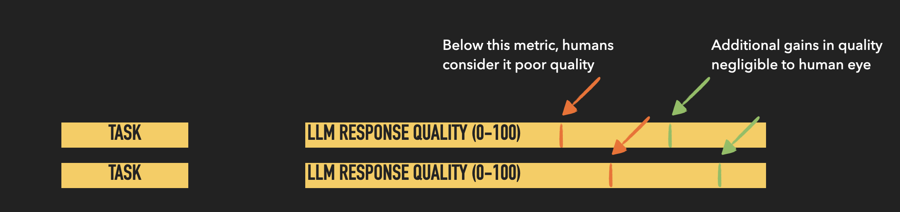

# The Global LLM Challenge
Thise repository hosts code for the global LLM challenge

A first of its kind internet-scale study that aims to answer two questions: a) is there a point on a quality curve above which additional gains in LLM response quality don’t lead to increased user satisfaction? and b) is there a similar point on a quality curve below which user satisfaction is considered undesirable? 

The majority of LLM vendors are in a race with each other to one-up benchmarks like MMLU, MTBench, HellowSwag etc - designed and rated primarily by human experts. But as LLMs get deployed in applications for end users and productivity workers, there hasn’t been a clear effort to study the impact of marginal improvements in quality as perceived by every-day users (not experts). 

## Table of Contents

- [High-level Setup](#high-level-setup)
- [Quality Curve Definition](#definitions)
- [Model Selection](#model-selection)
- [Task Selection](#task-selection)

## High-level setup
The experiment will be conducted via a single page web application. Users will see a greeting text, followed by a prompt and some context, and finally a randomly selected LLM response that they must rate on a likert scale of 1-5, or yes/no rating that matches the task represented in the prompt. 

Users will not be able to select prompts nor the LLM model that generates the response, all they will be required to do is to rate the LLM response. Users will be tracked via a cookie and be presented with another random triple (prompt, context, response) when they submit a response rating or when they refresh the page. For the same session, the user won’t be shown the same triple twice. 

In order for us to gather deeper insights from the study, we will need diversity in prompt-based tasks, diversity of task complexity, and diversity of response quality. These dimensions will help offer deeper insights into scenarios that impact user experience and satisfaction with LLM responses. In the following sections we define these dimensions in detail, starting with measuring and generating responses over a quality curve.

## Definitions
In order to run a study about human satisfaction with LLM responses, we must define quality and how to generate responses over a quality curve. There are several documented ways to measure the quality of an LLM response, including automatic scores like BLEU. ROGUE, human expert ratings, and recently LLM-assisted approaches that use few-shot and COT prompting techniques to evaluate an LLM response. 

Given budget and time constraints, we’ll use an LLM-assisted approach for high-quality and task-appropriate evaluation. For example, for summarization tasks we’ll use faithfulness (precision), completeness (recall), and measures like coherence and fluency. We’ll also use an LLM-assisted approach to create an aggregate measure of quality by applying a weighted measure of quality dimensions using NLP research that offers guidance on what matters most to users when evaluating text.

To build a response quality curve, we’ll use the size of the LLMs as a proxy for quality. In other words, we’ll rely on the scaling laws of LLMs that imply that smaller models lead to lower overall quality. While this won’t be precise in generating a smooth quality curve, it will match the practical spirit of our study - when using smaller models do I tradeoff satisfaction for cost? This will also be faster to implement as we’ll use one set of prompts and iterate over a set of LLMs that we have chosen as part of this study. For each response, we will use our LLM-assisted judge to evaluate responses based on the aggregated measure of quality defined above. 

## Model Selection
There isn’t any prior art that offers a reasonable framework to select models for our study. But we must select models of varying sizes that may offer insights into the two points on a quality curve, different licensing properties, and limit the number of models to reduce sparsity in collected samples. 

For these reasons, we limit OSS LLMs to Qwen 2-0.5B-Instruct, Qwen2-1.5B-Instruct, gemma-2-2B, Qwen2-7B-Instruct, Phi-3-small-128k-instruct, Qwen2-72B and Meta-Llama-3.1-70B. And for proprietary LLM models, we have limited our choices to Claude 3 Haiku, Claude 3.5 Sonnet, OpenAI GPT 3.5-Turbo and OpenAI GPT4-o. We have intentionally not chosen an OSS LLM with a 100B+ parameters, as the goal of the study isn’t to see which model type wins (OSS v. proprietary), but rather to gain a deeper understanding of user satisfaction with respect to size as a proxy for higher quality. 

## Tasks and Task Complexity
We are designing a study for end users, so we must be mindful of prompts they are likely to use so that we encourage them to read our study-generated prompts and rate the LLM responses. 

A survey (via ChatGPT, Google Search, and Gemini) revealed that users are most likely to engage an LLM for tasks like information extraction and summarization, creative tasks like writing a blog post or story, problem solving task like getting central ideas from a passage or writing business emails or brainstorming ideas to solve a problem at work/school.

 The following table captures a few examples of the prompts we will use in study. In total, we have generated a set of 30 prompts ranging in task complexity. The prompts and relevant context were generated by Gemini using COT reasoning techniques. Below are some samples of the tasks we used. See the [full list here](data/challenge_setup.csv)

| Category                      | Task                                          | Complexity | Prompt                                                                                                   | Context                                                                                                                                                                                                                                                                                                                                                                                                                                                                                                                                                                                                                                                                                  | Rating            |
|--------------------------------|----------------------------------------------|------------|-----------------------------------------------------------------------------------------------------------|------------------------------------------------------------------------------------------------------------------------------------------------------------------------------------------------------------------------------------------------------------------------------------------------------------------------------------------------------------------------------------------------------------------------------------------------------------------------------------------------------------------------------------------------------------------------------------------------------------------------------------------------------------------------------------------|-------------------|
| Information and Summarization  | Factual Comprehension (True/false questions) | 0          | Is the weather going to be sunny tomorrow in Seattle?                                                     | Here's a general outlook for Seattle over the next week. Tuesday, August 6 to Monday, August 12 Tuesday: Sunny and pleasant. Highs in the mid-70s. Wednesday: Sunny and warmer. Highs in the upper 70s. Thursday: Sunny and hot. Highs in the mid-80s.Friday: Partly cloudy with a slight chance of showers. Highs in the low 70s. Saturday: Partly cloudy and mild. Highs in the mid-70s. Sunday: Partly cloudy with a chance of showers. Highs in the upper 60s. Monday: Partly cloudy and cool. Highs in the mid-60s.                                                                                        | binary (yes/no)   |
| Information and Summarization  | Factual Comprehension (Detail-oriented questions) | 1          | How many characters are there in this story?                                                              | Once upon a time, there was an old sow with three little pigs. As she didn't have enough food for all of them, she sent them off to seek their fortunes. The first little pig was rather lazy and built his house of straw. The second pig was a bit more industrious and constructed his house of sticks. But it was the third little pig who showed true wisdom. He built his house of bricks, a sturdy and dependable structure. These three little pigs, each with their distinct personalities and building choices, would soon find themselves facing a big, bad wolf.                                        | likert            |
| Information and Summarization  | Inferential Comprehension (Making predictions) | 2          | What will happen to the lost puppy in the forest?                                                         | A young puppy, full of boundless energy and curiosity, has wandered away from its human companion and into the heart of a dense forest. The once familiar world of home has been replaced by a labyrinth of towering trees, shadowy undergrowth, and unfamiliar scents. The puppy, accustomed to the safety and warmth of human care, now faces a daunting array of challenges. From the perils of wild animals to the threats of hunger, thirst, and exposure, the forest presents a harsh and unforgiving environment. The puppy's survival will depend on its inherent instincts, physical abilities, and the unpredictable nature of its surroundings. | likert            |
| Information and Summarization  | Inferential Comprehension (Cause and effect) | 3          | Why did the king decide to go to war?                                                                     | The kingdom of Eldoria has enjoyed a long peace. Its borders have been secure, and its people prosperous. However, tensions with the neighboring empire of Zypheria have been simmering for years. Recent border skirmishes and the mysterious disappearance of Eldorian trade ships have heightened these tensions. Economic sanctions imposed by Zypheria have crippled Eldoria's trade, leading to widespread discontent among the populace. A nationalist movement has emerged, demanding retribution for the nation's perceived humiliation.                                                                     | likert            |
| Information and Summarization  | Inferential Comprehension (Implied meaning)   | 4          | What are the potential consequences of a group of teenagers finding a hidden portal to another dimension? | The small town of Willow Creek, known for its serene and picturesque environment, was nestled among rolling hills and lush forests. It seemed like a place where time stood still. However, this tranquility masked an ancient secret buried deep within the woods—a mysterious, otherworldly anomaly.    A diverse group of teenagers—a curious science enthusiast named Alex, a free-spirited artist named Luna, a practical athlete named Jake, and a book-loving introvert named Emily—came together through their mutual love for exploration. Seeking adventure and a break from the routine of small-town life, they often ventured into the woods on secret expeditions. Unbeknownst to them, their explorations would lead them to uncover a hidden portal, an event that would forever alter their lives.    One crisp autumn afternoon, the friends discovered a shimmering, translucent portal hidden at the base of a massive oak tree in a secluded clearing. The portal's ethereal glow captivated them, and despite their fears, curiosity compelled them to investigate further. Debating the risks and rewards, they decided to step through the portal, embarking on an extraordinary journey that would uncover ancient secrets, challenge their understanding of reality, and test their bond as friends. | likert            |
| Information and Summarization  | Critical Thinking and Analysis (Summarizing) | 5          | Write a short summary of the main events in the story.                                                     | In the quiet town of Willow Creek, four teenagers—Alex, Luna, Jake, and Emily—bond over their love for adventure. On one of their explorations in the nearby woods, they stumble upon a hidden portal at the base of an ancient oak tree. Despite their fears, curiosity drives them to step through the portal, transporting them to another dimension.    In this new world, they face a series of extraordinary events and challenges, uncovering ancient secrets and encountering strange beings. Their journey tests their courage, ingenuity, and the strength of their friendship. As they navigate this unfamiliar dimension, they must find a way back home while understanding the profound implications of their discovery.    Ultimately, their adventure leads to personal growth and a deeper bond among them, forever changing their lives and their perception of reality. | likert            |
| Information and Summarization  | Critical Thinking and Analysis (Comparing and contrasting) | 6          | How are the two main characters similar and different?                                                    | In the bustling city of Brookside, Alex and Luna are two of the four teenagers who discover a hidden portal in an abandoned warehouse. Alex, a curious science enthusiast, is analytical and logical, always seeking to understand the world through experiments and data. His motivation comes from a desire to uncover the unknown and make sense of the mysteries around him.    Luna, on the other hand, is a free-spirited artist driven by creativity and emotion. She views the world through a lens of beauty and wonder, often expressing her thoughts and feelings through her artwork. Her motivation lies in the pursuit of inspiration and the desire to explore the depths of her imagination.    Despite their different approaches, both characters share a profound curiosity and a thirst for adventure. They are united by their willingness to step into the unknown and face challenges head-on. While Alex approaches problems with a methodical mindset, Luna relies on intuition and creativity. Their contrasting perspectives often complement each other, allowing them to navigate the new dimension they discover while growing and learning from their unique strengths. | likert            |
| Information and Summarization  | Critical Thinking and Analysis (Evaluating arguments) | 7          | Evaluate the arguments presented by Alex and Luna about whether to continue exploring the new dimension despite the risks. Whose reasoning is more convincing, and why? | In the vibrant city of Brookside, four adventurous teenagers—Alex, Luna, Jake, and Emily—discover a hidden portal in an abandoned warehouse. Drawn by curiosity and a thirst for adventure, they step through and find themselves in a fantastical world like no other.    This new dimension is a place where gravity is optional, time flows like a lazy river, and the sky is a kaleidoscope of ever-changing colors. They encounter floating islands connected by shimmering bridges of light, forests with trees that sing, and creatures straight out of a fairytale.    However, as their journey progresses, Alex and Luna find themselves in a spirited debate. Alex, the science whiz, is thrilled by the endless possibilities for discovery. ""Imagine the breakthroughs in science and technology!"" he exclaims. ""We've navigated so many challenges already; we can handle more. The risks are worth the knowledge we could gain.""    Luna, the free-spirited artist, sees things differently. ""This place is beautiful but unpredictable,"" she argues. ""We've had some close calls, and our safety should come first. We already have amazing stories to tell. Let's not push our luck and risk losing everything."" | likert            |
| Information and Summarization  | Textual Analysis (Identifying literary devices) | 8          | Identify the metaphor used in the second paragraph.                                                       | In the bustling city of Brookside, four teenagers—Alex, Luna, Jake, and Emily—stumble upon a hidden portal in an abandoned warehouse. Drawn by curiosity, they step through and find themselves in a world unlike any they've ever known.    In this new dimension, they discover a realm where reality bends and shifts like a dream. The landscape is a patchwork quilt of floating islands, each one stitched together by threads of light. The sky above them is an artist's canvas, constantly changing colors and shapes as if painted by an invisible hand. Time flows differently here, moving like a river that meanders and loops back on itself.    As they explore this strange and beautiful place, they encounter creatures that defy logic and landscapes that challenge their perceptions. Alex, ever the scientist, tries to make sense of it all, while Luna sees it as a living masterpiece. Together, they navigate this wondrous world, their bond growing stronger with each new discovery. The journey tests their courage, creativity, and their ability to adapt to an ever-changing reality. | likert            |
| Information and Summarization  | Textual Analysis (Determining author's purpose) | 9          | What is the author's purpose for writing this article?                                                    | In an age where digital technology dominates everyday life, an article titled ""The Lost Art of Handwritten Letters"" appears in a popular lifestyle magazine. The author, Emma Hartfield, opens with a nostalgic reflection on the joy of receiving handwritten letters. She recounts her childhood memories of exchanging letters with her grandmother and the excitement of waiting for the mail.    Emma contrasts these personal experiences with today's fast-paced digital communication, where emails and instant messages prevail. She argues that while modern technology offers convenience and speed, it lacks the emotional depth and personal touch of handwritten correspondence. Through vivid descriptions and personal anecdotes, she highlights the unique qualities of handwritten letters: the effort involved, the individuality of each person's handwriting, and the tangible connection to the sender.    The article also delves into the historical significance of letter writing, citing famous correspondences between historical figures and the impact these letters had on their relationships and on history itself. Emma emphasizes that handwritten letters are a form of art, a way to express thoughts and emotions in a more deliberate and meaningful manner.    In addition to her nostalgic and historical perspectives, Emma offers practical advice for those who wish to revive the practice. She suggests starting small, perhaps with thank-you notes or birthday cards, and gradually incorporating letter writing into one's routine. She also encourages readers to see letter writing as a way to slow down and appreciate the act of thoughtful communication.    Throughout the article, Emma's tone is both persuasive and reflective, urging readers to consider the value of handwritten letters in an increasingly digital world. By the end of the article, it is clear that her purpose is to inspire a renewed appreciation for this lost art and to encourage readers to reconnect with others in a more personal and meaningful way. | likert            |
| Creative Writing and Content Generation | Basic Generation                          | 0          | Write a few sentences about the nature of planets in our solar systems.                                   | Empty                                                                                                                                                                                                                                                                                                                                                                                                                                                                                                                                                                                                                                                                                    | likert            |
|